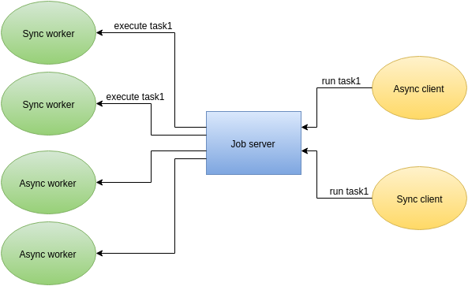

### Job server on Go + python client



Job server provides a generic application framework to farm out work to other machines or processes that are better suited to do the work. It allows you to do work in parallel, to load balance processing.
It support python 3, python2.7

### Compile
``` bash
go build -o jserver job_server/*.go
```

### Run
``` bash
> jserver
```

#### Arguments

* -log
* -couter
* -client localhost:8010
* -worker localhost:8011

### Example of python worker
``` python
import jclient

def echo(data):
    return data

rpc = jclient.WorkerHandler('localhost', 8011)
rpc.add('echo', echo)  #  attach a method
rpc.serve()
rpc.close()
```

### Example of python client
``` python
import jclient

rpc = jclient.ClientHandler('localhost', 8010)
result = rpc.call('echo', b'data')  # call a method
rpc.close()
```

### Example of python asyncio worker
``` python
import asyncio
from jclient.async import WorkerAsyncHandler

@asyncio.coroutine
def ping(raw):
    yield from asyncio.sleep(1)
    return b'pong'

def echo(raw):
    return raw

@asyncio.coroutine
def worker(loop):
    rpc = WorkerAsyncHandler('localhost', 8011, loop=loop)
    rpc.add('ping', ping)
    rpc.add('echo', echo)
    yield from rpc.serve()

loop = asyncio.get_event_loop()
loop.run_until_complete(worker(loop))
loop.close()
```

### Example of python asyncio client
``` python
import asyncio
from jclient.async import ClientAsyncHandler

@asyncio.coroutine
def run(loop):
    rpc = ClientAsyncHandler('localhost', 8010, loop=loop)

    result = yield from rpc.call('ping', b'data')
    print(result)

    rpc.close()

loop = asyncio.get_event_loop()
loop.run_until_complete(run(loop))
loop.close()
```

### License
[MIT](http://opensource.org/licenses/MIT)

Copyright (c) 2015 Oleg Nechaev <lega911@gmail.com>
